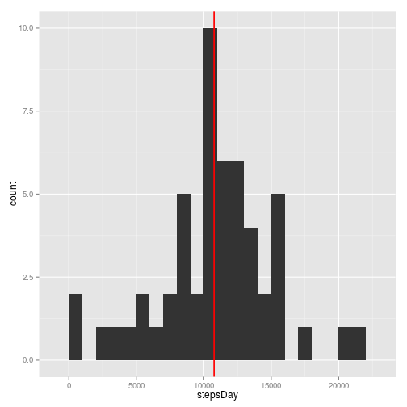
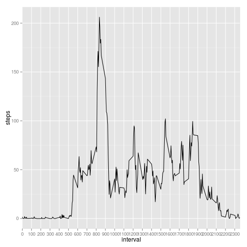
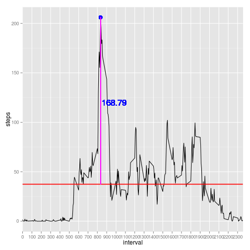
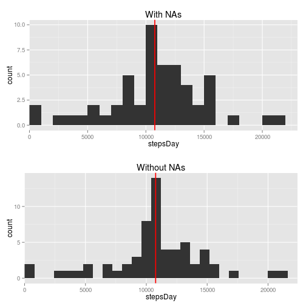
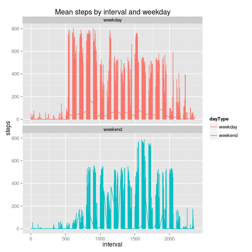

Peer Assessment 1: Reproducible Research
=============================================
  
## Welcome!  

Follow me through the assessment, I'll try to make things as light as possible.  
  
# Loading and preprocessing the data  

First let's download the data in a temporary file with the tempfile() and download.file() functions.  


```r
# Just one line to create a new temporary file, isn't it great?!
temp <- tempfile()

# Here I downloaded the file and put it in the temp file already created
download.file("https://github.com/alanmarazzi/RepData_PeerAssessment1/blob/master/activity.zip?raw=true", temp, mode = "wb")

# Let's unzip it before reading it...
unzip(temp, "activity.csv")

activity <- read.csv("activity.csv")

# Always remember to close the connection with the file!
unlink(temp)
```
  
It's always a good habit to take a look at variables, classes and so on... I love str(),
it's fast and gives a lot of information in a little space.  


```r
str(activity)
```

```
## 'data.frame':	17568 obs. of  3 variables:
##  $ steps   : int  NA NA NA NA NA NA NA NA NA NA ...
##  $ date    : Factor w/ 61 levels "2012-10-01","2012-10-02",..: 1 1 1 1 1 1 1 1 1 1 ...
##  $ interval: int  0 5 10 15 20 25 30 35 40 45 ...
```
  
Since we are working with dates let's convert them into date format. As we saw before "date" column is a factor, so it has to be converted to character and then to date.  


```r
activity$date <- as.Date(as.character(activity$date), "%Y-%m-%d")
```
  
# What is mean total number of steps taken per day?  

Let's see how many steps the guy takes per day. I use dplyr to group the dataset by date and sum the steps for every day.  

```r
library(dplyr)
```

```
## 
## Attaching package: 'dplyr'
## 
## The following objects are masked from 'package:stats':
## 
##     filter, lag
## 
## The following objects are masked from 'package:base':
## 
##     intersect, setdiff, setequal, union
```

```r
# Grouping and function by group in one line thanks to pipes: %>%. 
actbyDay <- activity %>% group_by(date) %>% summarize(stepsDay = sum(steps))

# Let's check if it worked
head(actbyDay)
```

```
## Source: local data frame [6 x 2]
## 
##         date stepsDay
##       (date)    (int)
## 1 2012-10-01       NA
## 2 2012-10-02      126
## 3 2012-10-03    11352
## 4 2012-10-04    12116
## 5 2012-10-05    13294
## 6 2012-10-06    15420
```
  
We want to see the mean and the median of steps taken per day.  


```r
mean(actbyDay$stepsDay, na.rm = TRUE)
```

```
## [1] 10766.19
```

```r
median(actbyDay$stepsDay, na.rm = TRUE)
```

```
## [1] 10765
```
  
An histogram is a very good way to check distribution and look for outliers. I love ggplot2 so I'll use it to plot the histogram of total steps taken per day.  


```r
library(ggplot2)
ggplot(actbyDay, aes(stepsDay))+ 
    geom_histogram(binwidth = 1000)+
    # I added the median as a red line to the plot 
    geom_vline(x = median(actbyDay$stepsDay, na.rm = TRUE), colour = "red", size = .8)
```

 
  
# What is the average daily activity pattern?  

The next step (see what I did there...) is to check for a daily activity pattern. I am going to group the dataset by interval and calculate the mean steps taker per interval.  


```r
# aggregate() is a good way to do this.
actbyPeriod <- aggregate(steps ~ interval, data = activity, FUN = mean)

# Let's check if it worked how we wanted to:
head(actbyPeriod)
```

```
##   interval     steps
## 1        0 1.7169811
## 2        5 0.3396226
## 3       10 0.1320755
## 4       15 0.1509434
## 5       20 0.0754717
## 6       25 2.0943396
```
  
It's easier to look for the pattern by visualizing the data. ggplot2 is your friend, never forget that!  


```r
library(ggplot2)
ggplot(actbyPeriod, aes(interval, steps, group = 1))+
    geom_line()+
    # This last line is just to reduce the number of ticks on x axis
    scale_x_discrete(breaks = pretty(actbyPeriod$interval, n = 20))
```

 
  
We can see a clear peak of mean steps taken at about interval 850. Let's check that!  


```r
# First let's see which interval has the most steps taken.
actbyPeriod[which.max(actbyPeriod$steps),]
```

```
##     interval    steps
## 104      835 206.1698
```
  

```r
# I store the difference between the peak and the mean.
delta <- actbyPeriod[which.max(actbyPeriod$steps), "steps"] - mean(actbyPeriod$steps)

# Now I can easily add info to the previous plot
ggplot(actbyPeriod, aes(interval, steps, group = 1))+
    geom_line()+
    scale_x_discrete(breaks = pretty(actbyPeriod$interval, n = 20))+
    geom_hline(y = mean(actbyPeriod$steps, na.rm = TRUE), colour = "red", size = .8)+
    geom_point(x = 835, y = 206.1698, colour = "blue", size = 4)+
    geom_linerange(x = 835, ymin = mean(actbyPeriod$steps), ymax = 206.1698, size = .4, colour = "magenta", alpha = .5)+
    geom_text(x = 980, y = 120, label = as.character(round(delta, 2)), size = 6, colour = "blue")
```

 
  
# Imputing missing values  

Let's deal with NAs, first check how many NAs there are and if they are located in one or more columns.  


```r
# Check for NAs with is.na() function and store them
miss <- is.na(activity$steps)

# In this way we can check how many NAs there are in the dataset, their share
# and if they are only in one column.
sum(miss)
```

```
## [1] 2304
```

```r
mean(miss)
```

```
## [1] 0.1311475
```

```r
sum(is.na(activity$date))
```

```
## [1] 0
```

```r
sum(is.na(activity$interval))
```

```
## [1] 0
```
  
NAs are all in "steps" variable, so substitute them with the corresponding "interval" mean.  


```r
# zoo package is helpful here: na.aggregate() groups NAs and substitutes them according 
# to a function FUN
library(zoo)
```

```
## 
## Attaching package: 'zoo'
## 
## The following objects are masked from 'package:base':
## 
##     as.Date, as.Date.numeric
```

```r
actnoNA <- na.aggregate(activity$steps, by = activity$interval, FUN = mean)

# Create a new dataframe without NAs and check that is NA free.
activityNew <- activity
activityNew$steps <- actnoNA
sum(is.na(activityNew))
```

```
## [1] 0
```
  
# Are there differences in activity patterns between weekdays and weekends?  

Check if the mean and median changed compared to the dataset with NAs.  
  

```r
actNewbyDay <- activityNew %>% group_by(date) %>% summarize(stepsDay = sum(steps))

median(actNewbyDay$stepsDay)
```

```
## [1] 10766.19
```

```r
mean(actNewbyDay$stepsDay)
```

```
## [1] 10766.19
```

```r
median(actbyDay$stepsDay, na.rm = TRUE)-median(actNewbyDay$stepsDay)
```

```
## [1] -1.188679
```

```r
mean(actbyDay$stepsDay, na.rm = TRUE)-mean(actNewbyDay$stepsDay)
```

```
## [1] 0
```
  
Compare histograms with and without NAs. Here I borrow a function from [R Cookbook] (http://www.cookbook-r.com/Graphs/Multiple_graphs_on_one_page_(ggplot2)/) for plotting multiple ggplots at once.  
  

```r
multiplot <- function(..., plotlist=NULL, file, cols=1, layout=NULL) {
    library(grid)
    
    # Make a list from the ... arguments and plotlist
    plots <- c(list(...), plotlist)
    
    numPlots = length(plots)
    
    # If layout is NULL, then use 'cols' to determine layout
    if (is.null(layout)) {
        # Make the panel
        # ncol: Number of columns of plots
        # nrow: Number of rows needed, calculated from # of cols
        layout <- matrix(seq(1, cols * ceiling(numPlots/cols)),
                         ncol = cols, nrow = ceiling(numPlots/cols))
    }
    
    if (numPlots==1) {
        print(plots[[1]])
        
    } else {
        # Set up the page
        grid.newpage()
        pushViewport(viewport(layout = grid.layout(nrow(layout), ncol(layout))))
        
        # Make each plot, in the correct location
        for (i in 1:numPlots) {
            # Get the i,j matrix positions of the regions that contain this subplot
            matchidx <- as.data.frame(which(layout == i, arr.ind = TRUE))
            
            print(plots[[i]], vp = viewport(layout.pos.row = matchidx$row,
                                            layout.pos.col = matchidx$col))
        }
    }
}
histNA <- ggplot(actbyDay, aes(stepsDay))+
    geom_histogram(binwidth = 1000)+
    geom_vline(x = median(actbyDay$stepsDay, na.rm = TRUE), colour = "red", size = .8)+
    scale_x_continuous(expand = c(0,0), limits = c(0,max(actbyDay$stepsDay)))+
    ggtitle("With NAs")
histnoNA <- ggplot(actNewbyDay, aes(stepsDay))+
    geom_histogram(binwidth = 800)+
    geom_vline(x = median(actNewbyDay$stepsDay), colour = "red", size = .8)+
    scale_x_continuous(expand = c(0,0), limits = c(0,max(actbyDay$stepsDay)))+
    ggtitle("Without NAs")

multiplot(histNA, histnoNA)
```

 
  
Last thing: is the guy walking more during weekdays or weekends? Let's find out!  
  
  

```r
# lubridate package is very good for dealing with dates
library(lubridate)

# Turn dates into days, like Mon, Tue, etc.
activityNew$day <- wday(activityNew$date, label = TRUE)

# Create a new column in the dataset containing "weekday" in all the rows
activityNew$dayType <- c("weekday")

# A simple loop looking for Saturdays and Sundays and imputing "weekend"
# in the new column for corresponding days.
for(i in 1:nrow(activityNew)){
    if(activityNew$day[i] == "Sat" | activityNew$day[i] == "Sun"){
        activityNew$dayType[i] <- "weekend"
    }
}

# Turn the variable into a factor with two levels: "weekday" and "weekend"
activityNew$dayType <- as.factor(activityNew$dayType)

# Aggregate the dataframe by interval and the type of day (weekend or not)
actbyPeriodNew <- aggregate(steps ~ interval + dayType, data = activityNew, FUN = mean)

# Plot the number of steps taken by interval and in weekends and weekdays.
ggplot(activityNew, aes(interval, steps, colour = dayType))+
    facet_wrap(~dayType, ncol = 1)+
    geom_line()+
    ggtitle("Mean steps by interval and weekday")
```

 
  
## That's it! Hope I didn't bore you to death, if you want let me know what you think of my work and/or get in touch with me. Cheers

Alan Marazzi
